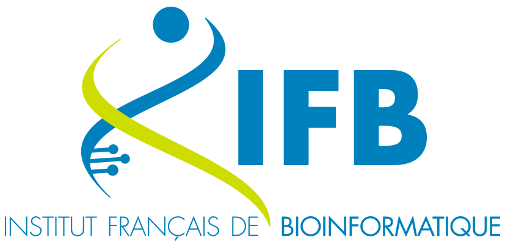
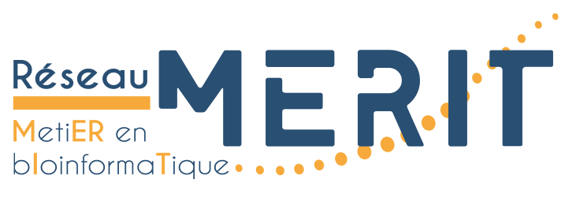

<table style="width: 600px; border: none;" cellpadding="10" align="center">
  <tr>
    <td align="center">
      
    </td>
    <td align="center">
      
    </td>
    <td align="center">
      
    </td>
    <td align="center">
      
    </td>
    <td align="center">
      
    </td>
  </tr>
</table>

# Utilisation des IA génératives comme appui à la programmation et au scripting pour la biologie

## Information pratique et programme

- <https://moodle.france-bioinformatique.fr/course/view.php?id=41>

## Organisation

Le colloque est organisé et financé par les trois organisations suivantes :

- [Institut Français de Bioinformatique (IFB)](https://www.france-bioinformatique.fr/)
- Université Paris Cité ([plateforme iPOP-UP](https://ipop.u-paris.fr/) et [DU omiques](https://ipop.u-paris.fr/duomiques/))
- [Réseau métier en bioinformatique (MERIT)](https://merit.cnrs.fr/)

L'Institut Français de Bioinformatique (IFB) a été fondé par les Programme d'Investissements d'Avenir subventionné par l'Agence Nationale de la Recherche ([RENABI-IFB, ANR-11-INBS-0013](https://anr.fr/ProjetIA-11-INBS-0013)) et par le programme France 2030 relatifs aux équipements structurants pour la recherche / EQUIPEX+ ([MUDIS4LS, ANR-21-ESRE-0048](https://anr.fr/ProjetIA-21-ESRE-0048)).

### Encadrants

- [Imane Messak](https://orcid.org/0000-0002-1654-6652) (Institut Français de Bioinformatique)
- [Thomas Denecker](https://orcid.org/0000-0003-1421-7641) (Institut Français de Bioinformatique)
- [Baptiste Rousseau](https://orcid.org/0009-0002-1723-2732) (Institut Français de Bioinformatique)

## Atelier : Développement logiciel

Dans cet atelier, nous explorerons comment l’intelligence artificielle peut devenir un véritable assistant au service du développement logiciel. À l’aide d’outils comme [Pleiade](https://pleiade.mi.parisdescartes.fr/), [chatGPT](https://chat.openai.com/), [Perplexity](https://www.perplexity.ai/) ou d’autres assistants basés sur l’IA, les participant·es apprendront à:

- Corriger automatiquement des erreurs dans leur code (syntaxe, logique, style)

- Optimiser des portions de code pour plus d'efficacité ou de lisibilité

- Suggérer des améliorations respectant les bonnes pratiques de programmation

- Passer avec succès les vérifications automatiques d'intégration continue (CI)

- Générer ou compléter automatiquement des fonctions, des tests unitaires ou de la documentation

Cet atelier a pour but de montrer comment l’IA peut accompagner les bioinformaticiens dans leurs projets de scripting et d’analyse, en réduisant le temps passé à déboguer et en augmentant la qualité du code produit.

### Instruction pour l'atelier

1. Fork le project
2. Clone le projet
3. Ouvre le projet et commence a debuger avec ton outils IA préférer

À la fin de la session dans le `README`:

- Ajouter l’outil utilisé (pléiade, chatGPT, copitot,...)
- Ajouter le modèle utilisé
- Ajouter le nombre de requêtes réalisée

## Contributor Code of conduct

Veuillez noter que ce projet est publié avec [Contributor Code of Conduct](https://www.contributor-covenant.org/). En participant, vous acceptez d’en respecter les termes. Voir le fichier [CODE_OF_CONDUCT](code_of_conduct.md).

## Licence

[![CC BY-SA 4.0][cc-by-sa-image]][cc-by-sa]

[![CC BY-SA 4.0][cc-by-sa-shield]][cc-by-sa]

[cc-by-sa]: http://creativecommons.org/licenses/by-sa/4.0/
[cc-by-sa-image]: https://licensebuttons.net/l/by-sa/4.0/88x31.png
[cc-by-sa-shield]: https://img.shields.io/badge/License-CC%20BY--SA%204.0-lightgrey.svg

----
